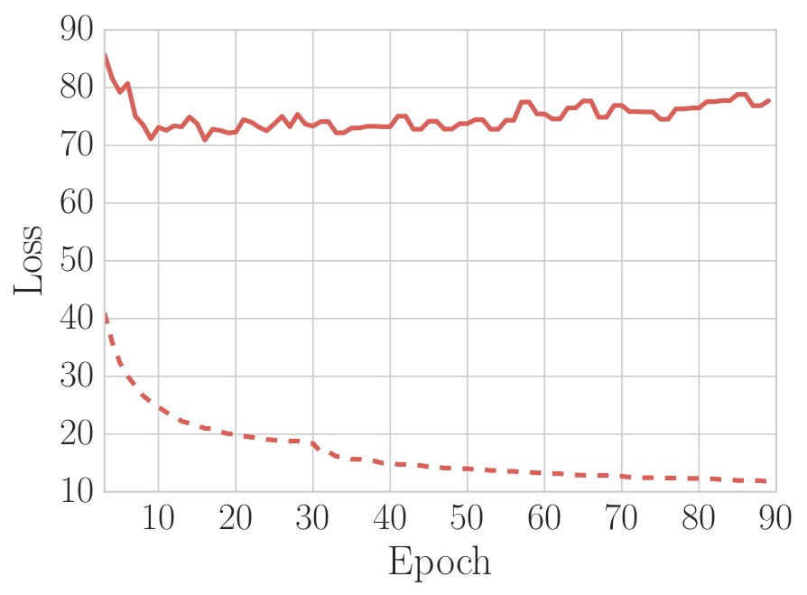
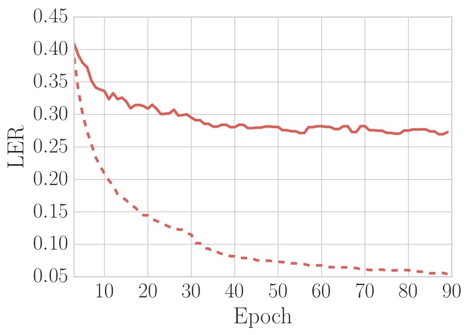

# asr-study: a study of all-neural speech recognition models
This repository contains my efforts on developing an end-to-end ASR system using Keras and Tensorflow.

## Training a character-based all-neural Brazilian Portuguese speech recognition model

Our model was trained using four datasets: [CSLU Spoltech (LDC2006S16)](https://catalog.ldc.upenn.edu/LDC2006S16), Sid, [VoxForge](http://www.voxforge.org), and [LapsBM1.4]( http://www.laps.ufpa.br/falabrasil/). Only the CSLU dataset is paid.

#### Set up the (partial) Brazilian Portuguese Speech Dataset (BRSD)

You can download the freely available datasets with the provided script (it may take a while):

```bash
$ cd data; sh download_datasets.sh
```

Next, you can preprocess it into an hdf5 file. Click [here](extras/make_dataset.py) for more information.

```bash
$ python -m extras.make_dataset --parser brsd --input_parser mfcc
```

#### Train the network

You can train the network with the `train.py` script. For more usage information see [this](train.py). To train with the default parameters:

```bash
$ python train.py --dataset .datasets/brsd/data.h5
```

## Pre-trained model

You may download a pre-trained [brsm v1.0 model](core/models.py) over the full brsd dataset (including the CSLU dataset):

```bash
$ mkdir models; sh download_brsmv1.sh
```

Also, you can evaluate the model against the **brsd** test set

```bash
$ python eval.py --model models/brsmv1.h5 --dataset .datasets/brsd/data.h5
```

#### brsmv1.h5 training

<div align=center>
  
  
</div>

Test set: LER **25.13%** (using beam search decoder with beam width of 100)


## Predicting the outputs

To predict the outputs of a trained model using some dataset:

```bash
$ python predict.py --model MODEL --dataset DATASET
```

## Available dataset parsers
You can see in [datasets/](datasets/) all the datasets parsers available.

#### Creating a custom dataset parser

You may create your own dataset parser. Here an example:

```python
class CustomParser(DatasetParser):

    def __init__(self, dataset_dir, name='default name', **kwargs):
        super(CustomParser, self).__init__(dataset_dir, name, **kwargs)

    def _iter(self):
      for line in dataset:
        yield {'duration': line['duration'],
               'input': line['input'],
               'label': line['label'],
               'non-optional-field': line['non-optional-field']}

    def _report(self, dl):
      args = extract_statistics(dl)
      report = '''General information
                  Number of utterances: %d
                  Total size (in seconds) of utterances: %.f
                  Number of speakers: %d''' % (args)
```

## Available models
You can see all the available models in [core/models.py](core/models.py)
#### Creating a custom model

You may create your custom model. Here an example of CTC-based model

```python
def custom_model(num_features=26, num_hiddens=100, num_classes=28):

    x = Input(name='inputs', shape=(None, num_features))
    o = x

    o = Bidirectional(LSTM(num_hiddens,
                      return_sequences=True,
                      consume_less='gpu'))(o)
    o = TimeDistributed(Dense(num_classes))(o)

    return ctc_model(x, o)
```
## Contributing
There are a plenty of work to be done. All contributions are welcome :).

#### asr-related work
* Add new layers
  * Batch normalized recurrent neural networks [arXiv](https://arxiv.org/abs/1510.01378)
  * Batch recurrent normalization [arXiv](https://arxiv.org/abs/1603.09025)
* Reproduce topologies and results
  * [EESEN](https://arxiv.org/abs/1507.08240)
  * [Deep Speech 2](https://arxiv.org/abs/1512.02595)
  * ConvNet-based architectures
* Add language model
  * [WFST](https://arxiv.org/abs/1507.08240)
  * [RNNLN](http://www.fit.vutbr.cz/~imikolov/rnnlm/)
  * Beam search decoder with LM or CLM
* Encoder-decoder models with attention mechanism
* ASR from raw speech
* Real-time ASR

#### brsp-related work
* Investigate the brsdv1 model with
  * Multiplicative integration [arXiv](https://arxiv.org/abs/1606.06630)
  * Layer nomalization [arXiv](https://arxiv.org/abs/1607.06450)
  * Zoneout [arXiv](https://arxiv.org/abs/1606.01305)
* Increase the number of datasets (ideally with free datasets)
* Improve the LER
* Train a language model

#### code-related work
* Test coverage
* Examples
* Better documentation
* Improve the API
* More features extractors, see [audio](preprocessing/audio.py) and [text](preprocessing/text.py)
* More datasets parsers
  * [LibriSpeech](http://www.openslr.org/12/)
  * [Teldium](http://www-lium.univ-lemans.fr/en/content/ted-lium-corpus))
  * WSJ
  * Switchboard
  * [TIMIT](https://catalog.ldc.upenn.edu/ldc93s1)
  * [VCTK](http://homepages.inf.ed.ac.uk/jyamagis/page3/page58/page58.html)
* **Implement a nice wrapper for Kaldi in order to enjoy their feature extractors**
* Better way of store the entire preprocessed dataset

#### Known bugs
* High memory and CPU consumption
* Predicting with batch size greater than 1 (Keras' bug)
* warp-ctc does not seem to speed up training
* [zoneout](core/layers.py) implementation


## Requirements

#### basic requirements
* Python 2.7
* Numpy
* Scipy
* Pyyaml
* HDF5
* Unidecode
* Librosa
* Tensorflow
* Keras

#### recommended
* [warp-ctc](https://github.com/baidu-research/warp-ctc) (for fast CTC loss calculation)

#### optional
* [SpeechRecognition](https://pypi.python.org/pypi/SpeechRecognition/) (to use the [eval apis](extras/eval_apis.py))
* [openpyxl](https://pypi.python.org/pypi/openpyxl) (to [save the results in a excel file](extras/results2xlsx.py))

## Acknowledgements
* [python_speech_features](https://github.com/jameslyons/python_speech_features) for the [audio preprocessing](preprocessing/audio.py)
* [Google Magenta](https://github.com/tensorflow/magenta) for the [hparams](core/hparams.py)
* @robertomest for helping me with everything

## License
See [LICENSE.md](LICENSE.md) for more information
